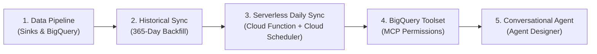

# Gemini Enterprise App Analytics For Business Value

A comprehensive, enterprise-ready data pipeline and conversational analytics solution that delivers executive visibility, user adoption tracking, cross-feature synergies, and creator governance for **Google Gemini Enterprise (GE) App** and **NotebookLM Enterprise**.

---

## 👔 Executive Overview

As organizations scale their generative AI strategy, enterprise executives, IT administrators, and product leaders require transparent, quantitative insights into platform adoption, employee engagement, and ROI.

While Gemini Enterprise provides rich native capabilities, enterprise visibility traditionally requires navigating disconnected audit logs and opaque backend system IDs. This solution bridges that gap by establishing a **centralized analytics data warehouse in BigQuery** and pairing it with a **No-Code Conversational Analytics Agent**.

### Key Business Value Delivered:

| Focus Area | Executive & Business Value |
| :--- | :--- |
| **📈 Daily Active Users & Growth Trends** | Track organization-wide Daily Active Users (DAU) and adoption curves across days, weeks, and months. |
| **🔄 Cross-Product Feature Adoption** | Quantify employee adoption percentages across **Core Chat**, **NotebookLM Enterprise**, and **Custom Agents**, highlighting multi-feature power users. |
| **🏆 Agent Popularity & Session Volume** | Rank custom enterprise agents by session count, monthly active user volume, and engagement lifecycle (`first_active_date` to `last_active_date`). |
| **🛡️ Agent Governance & Connector Auditing** | Identify exactly who built each agent or skill (`creator_email`), creation timestamps, attached enterprise connectors (`connector_types`, `connector_ids` e.g. SharePoint, Outlook, BigQuery MCP, GitHub), data stores, underlying system instructions, and architecture (`ADK Agent`, `Agent Builder (UI)`, `Workflow Agent`, `Skill`, `Managed Agent`). |
| **💬 Natural Language Analytics** | Empower leadership, HR, and business teams to query complex usage metrics using everyday conversational English through the Gemini Enterprise chat interface. |

---

## 🗺️ High-Level Deployment Lifecycle

The end-to-end deployment follows five structured, automated phases:



* **1. Provision Storage & Real-Time Sinks:** Deploy the BigQuery dataset, storage tables, enriched analytical views, and Cloud Logging sinks for Chat & NotebookLM Enterprise (`setup_infra.sh`).
* **2. Backfill Historical Activity:** Execute a one-time 365-day backfill to harvest past agent creation audit logs, user activity, and initial session metrics (`initial_data_sync.sh`).
* **3. Automate Daily Synchronization:** Deploy a lightweight, serverless Cloud Function + Cloud Scheduler job to refresh session metrics and newly created agents every night (`deploy.sh`).
* **4. Expose Data via BigQuery Toolset:** Grant end users or workforce identity pools permissions to invoke the managed BigQuery MCP tool.
* **5. Deploy Conversational Agent:** Generate the tailored prompt with embedded knowledge base (`generate_prompt.py`) and paste it into Agent Designer.

---

## 🏛️ Analytical Data Architecture

The pipeline exports and merges disparate telemetry streams into structured tables and enriched analytical views in BigQuery (Dataset: `ge_metrics`). For detailed schema definitions and field-by-field breakdowns, see [Detailed End-to-End Data Flow](flow.md):


### 🗄️ Enriched Analytical Views (Used by the Analytics Agent)

1. **`vw_feature_adoption_summary` (Master System Usage View):**
   Pre-aggregates total active users, standalone feature percentages (`chat_pct`, `notebooklm_pct`, `agent_pct`), and power user intersections (`chat_and_notebooklm_pct`, `all_three_pct`) by date.
2. **`vw_user_feature_adoption` (User-Level Drilldown):**
   Daily user-level activity flags and specific agent usage history for per-user engagement reporting.
3. **`vw_unified_metrics` (Agent Leaderboards):**
   Aggregates session counts, monthly active users, and first/last active dates by human-readable agent display name.
4. **`vw_agent_creators` (Governance, Creator Attribution & Connectors):**
   Maps agent IDs to creator email, creation timestamp, agent architecture, description, system instructions, attached connectors (`connector_types`, `connector_ids`), and data stores (`datastore_names`).

---

## 🚀 Step-by-Step Implementation Guide

### Prerequisites & Required IAM Roles

#### 1. Deployment & Admin IAM Roles
Ensure the administrator or service account deploying the infrastructure has:
* **Project IAM Admin** (`roles/resourcemanager.projectIamAdmin`) - To bind required IAM roles to the service accounts.
* **Service Usage Admin** (`roles/serviceusage.serviceUsageAdmin`) - To enable BigQuery, Cloud Functions, and Cloud Logging APIs.
* **BigQuery Data Owner** (`roles/bigquery.dataOwner`) & **Job User** (`roles/bigquery.jobUser`) - To provision and query datasets.
* **Logs Configuration Writer** (`roles/logging.configWriter`) - To configure Cloud Logging sinks.
* **Cloud Functions Admin** (`roles/cloudfunctions.admin`) & **Cloud Scheduler Admin** (`roles/cloudscheduler.admin`) - To deploy the serverless nightly sync.
* **Discovery Engine Admin** (`roles/discoveryengine.admin`) - To manage Gemini Enterprise App configurations, list agents, and export metrics.

#### 2. Serverless Runtime Service Account Roles (Automated Daily Sync)
The Cloud Function / Cloud Run runtime service account (`<PROJECT_NUMBER>-compute@developer.gserviceaccount.com` or custom SA) requires:
* **Discovery Engine Editor** (`roles/discoveryengine.editor`) - To query active agent definitions (`discoveryengine.agents.list`) and trigger session metrics export (`discoveryengine.analytics.exportMetrics`).
* **BigQuery Data Editor** (`roles/bigquery.dataEditor`) - To create temporary staging tables and upsert records into `agent_names`.
* **BigQuery Job User** (`roles/bigquery.jobUser`) - To execute BigQuery load jobs and `MERGE` queries (`bigquery.jobs.create`).
* **Cloud Build Builder** (`roles/cloudbuild.builds.builder`) - To build the Cloud Function container during deployment.

> *Note: [`deploy.sh`](analytics_pipeline/cloud_function/deploy.sh) and [`setup_infra.sh`](analytics_pipeline/infra_setup/setup_infra.sh) automatically bind these roles to the service account during execution.*

#### 3. End-User / Consumer Permissions (For Querying via Agent)
Because BigQuery MCP tool calls execute under the security context of the **end user**, all employees (or their Entra ID / Workforce Identity Federation pool) interacting with the agent must have:
* **MCP Tool User** (`roles/mcp.toolUser`)
* **BigQuery Job User** (`roles/bigquery.jobUser`)
* **BigQuery Data Viewer** (`roles/bigquery.dataViewer`) on the analytics dataset

#### 4. Organization Policy Requirements
If your organization enforces strict Organization Policies, verify that Model Context Protocol (MCP) server connectors are not blocked:
* **Constraint:** `constraints/discoveryengine.managed.disableCustomMcpServerConnector` (ensure this is set to **False** or allowed for your project/folder).
* Ensure managed tool connectors for BigQuery are permitted under your Gemini Enterprise security policy.

---

### Step 1: Environment Configuration

1. **Clone the repository and navigate to `analytics_pipeline/`:**
   ```bash
   git clone https://github.com/mpolski/ge-analytics-4-business-value.git
   cd ge-analytics-4-business-value/analytics_pipeline
   ```

2. **Configure your `.env` file:**
   ```bash
   cp .env_template .env
   ```
   Edit `.env` with your project parameters:
   ```bash
   PROJECT_ID="your-gcp-project-id"
   ENGINE_ID="your-gemini-enterprise-engine-id"  # Found in GCP Console > Gemini Enterprise > Apps
   GE_LOCATION="global"                          # 'global', 'us', or 'eu'
   DATASET_ID="ge_metrics"                       # Target BigQuery Dataset
   BQ_LOCATION="US"                              # 'US' or 'EU'
   ```

3. **Enable the BigQuery API:**
   ```bash
   gcloud services enable bigquery.googleapis.com --project=PROJECT_ID
   ```

4. **Install local Python dependencies (using `uv`):**
   ```bash
   cd ..
   uv sync --no-dev
   cd analytics_pipeline
   ```

5. **Authenticate with Application Default Credentials (ADC):**
   ```bash
   gcloud auth application-default login
   ```

---

### Step 2: One-Click Infrastructure Setup & Observability Configuration

By default, NotebookLM Enterprise telemetry is disabled until explicit project-level observability is turned on.

Run the master infrastructure script to provision the BigQuery dataset, base storage tables, real-time logging sinks, NotebookLM Enterprise observability, and all 4 enriched views:

```bash
chmod +x infra_setup/setup_infra.sh
./infra_setup/setup_infra.sh
```

#### What `setup_infra.sh` Automates Under the Hood:
1. **Enables NotebookLM Enterprise Real-Time Usage Audit Logs:**
   Executes the required Discovery Engine project-level PATCH to activate observability:
   ```bash
   curl -X PATCH \
     -H "Authorization: Bearer $(gcloud auth print-access-token)" \
     -H "Content-Type: application/json" \
     -H "x-goog-user-project: $PROJECT_ID" \
     "https://discoveryengine.googleapis.com/v1alpha/projects/${PROJECT_ID}?updateMask=customerProvidedConfig.notebooklmConfig.observabilityConfig" \
     -d '{
       "customerProvidedConfig": {
         "notebooklmConfig": {
           "observabilityConfig": {
             "observabilityEnabled": true,
             "sensitiveLoggingEnabled": true
           }
         }
       }
     }'
   ```
   *(For details, see the official [Google Cloud NotebookLM Enterprise Usage Audit Logs Documentation](https://docs.cloud.google.com/gemini/enterprise/notebooklm-enterprise/docs/set-up-usage-audit-logs-for-nblme)).*

2. **Provisions Real-Time Cloud Logging Sinks:**
   Creates log sinks routing `discoveryengine.googleapis.com/gemini_enterprise_user_activity` and `discoveryengine.googleapis.com/notebooklm_enterprise_user_activity` directly into partitioned BigQuery tables.

3. **Builds Enriched Analytical Views:**
   Creates `vw_feature_adoption_summary`, `vw_user_feature_adoption`, `vw_unified_metrics`, and `vw_agent_creators`.

---

### Step 3: Initial Data Sync & Historical Backfill

Run the unified ingestion script to backfill up to 365 days of historical data and trigger your first session metrics export:

```bash
chmod +x data_pipelines/initial_data_sync.sh
./data_pipelines/initial_data_sync.sh
```

This single command executes 4 ingestion stages with live animated progress indicators:
1. **Live Agent Metadata**: Extracts active agent definitions and prompts from Vertex AI.
2. **Historical Creators (365 Days)**: Harvests agent creation audit events into `historical_creators`.
3. **Historical User Activity (365 Days)**: Backfills past Chat, Agent, and NotebookLM interaction logs.
4. **Metrics Export**: Triggers Discovery Engine `exportMetrics` into `agent_session_metrics`.

---

### Step 4: Deploy Serverless Nightly Sync

To ensure session counts and newly created custom agents are continuously kept up to date, deploy the lightweight Cloud Function and Cloud Scheduler job:

```bash
chmod +x cloud_function/deploy.sh
./cloud_function/deploy.sh
```

* **Zero Custom Containers:** Uses standard Google Cloud Function Python runtimes (no Docker or Artifact Registry setup needed).
* **Automated Trigger:** Configured to run every night at **00:00 UTC** (`0 0 * * *`) with secure service account OIDC authentication.
* **Automated IAM Provisioning:** `deploy.sh` automatically grants the required runtime roles (`roles/discoveryengine.editor`, `roles/bigquery.dataEditor`, `roles/bigquery.jobUser`, `roles/cloudbuild.builds.builder`) to the runtime service account (`<PROJECT_NUMBER>-compute@developer.gserviceaccount.com`).

*(Optional) If your environment restricts automatic IAM policy updates, grant the runtime roles manually beforehand:*
```bash
PROJECT_NUM=$(gcloud projects describe <YOUR_PROJECT_ID> --format='value(projectNumber)')
SA="${PROJECT_NUM}-compute@developer.gserviceaccount.com"

# Grant Discovery Engine Editor (list agents & export metrics)
gcloud projects add-iam-policy-binding <YOUR_PROJECT_ID> --member="serviceAccount:$SA" --role="roles/discoveryengine.editor"

# Grant BigQuery Data Editor & Job User (merge tables & run staging jobs)
gcloud projects add-iam-policy-binding <YOUR_PROJECT_ID> --member="serviceAccount:$SA" --role="roles/bigquery.dataEditor"
gcloud projects add-iam-policy-binding <YOUR_PROJECT_ID> --member="serviceAccount:$SA" --role="roles/bigquery.jobUser"
```

---

### Step 5: End-User & Identity Permissions (Required for MCP Tools)

In Gemini Enterprise, BigQuery tool calls execute **on behalf of the authenticated end-user**. Before creating the data store and testing your agent, ensure your end-users (via Google Cloud IdP / Google Workspace, Google Groups, or Workforce Identity Federation) have the required IAM roles on the Google Cloud project.

Set your `IDENTITY` variable based on your environment:

#### Option A: Google Cloud IdP / Google Workspace (Cloud Identity)
```bash
# For a single user:
IDENTITY="user:your-email@yourcompany.com"

# OR for a Google Group (Recommended for teams/pilots):
IDENTITY="group:gemini-users@yourcompany.com"

# OR for your entire Google Workspace / Cloud Identity domain:
IDENTITY="domain:yourcompany.com"
```

#### Option B: Workforce Identity Federation (WIF / Entra ID / Okta)
```bash
# For an entire workforce pool:
IDENTITY="principalSet://iam.googleapis.com/locations/global/workforcePools/<POOL_ID>/*"

# OR for a specific group in your workforce pool:
IDENTITY="principalSet://iam.googleapis.com/locations/global/workforcePools/<POOL_ID>/group/<GROUP_NAME>"
```

#### Grant Required Roles
Once `IDENTITY` is set, run the following commands:
```bash
# 1. Permission to execute MCP tools in Gemini Enterprise
gcloud projects add-iam-policy-binding <YOUR_PROJECT_ID> \
    --member="$IDENTITY" \
    --role="roles/mcp.toolUser"

# 2. Permission to run BigQuery SQL query jobs
gcloud projects add-iam-policy-binding <YOUR_PROJECT_ID> \
    --member="$IDENTITY" \
    --role="roles/bigquery.jobUser"

# 3. Permission to read tables and views in the analytics dataset
gcloud projects add-iam-policy-binding <YOUR_PROJECT_ID> \
    --member="$IDENTITY" \
    --role="roles/bigquery.dataViewer"
```

---

### Step 6: Configure BigQuery MCP Data Store in Gemini Enterprise

To integrate Gemini Enterprise with data in BigQuery, configure a Data Store in the GE App that leverages the fully managed BigQuery MCP service:

#### 1. Create the BigQuery Data Store
1. In the Google Cloud Console, navigate to **Gemini Enterprise** > **Data stores**.
2. Click **Create data store** (`+`).
3. Under **Select a data source**, select the **BigQuery** connector (or **Custom MCP Server**).
4. Configure your connection to point to your analytics dataset (use the `DATASET_ID` defined in your `.env`, e.g., `busines_value_agent` or `ge_metrics`).
5. Select your multi-region location (e.g., `US` or `EU`, matching `BQ_LOCATION`) and assign a name (e.g., `ge-metrics-bigquery-store`).
6. Click **Create** and monitor the data store list until the status changes from `Creating` to **`Active`**.

#### 2. Enable Actions (Tools)
1. Open your BigQuery data store from the **Data stores** list.
2. In the **Actions** tab, click **Reload actions** (or browse available actions) to list the tools exposed by the BigQuery MCP service.
3. Select the analytical query actions to enable:
   - ✅ `execute_sql_readonly`
   - ✅ `describe_table`
   - ✅ `list_tables`
4. Click **Enable actions** (or **Save**). These read-only tools execute automatically during conversations without prompting the end user.

---

### Step 7: Deploy the Conversational Analytics Agent

You have two flexible deployment paths:

#### Option A: Agent Designer + BigQuery Data Store (UI Agent)
1. Generate the tailored prompt:
   ```bash
   uv run python agent_designer/generate_prompt.py
   ```
2. Open **Gemini Enterprise** > **Agent Designer** > Create **"GE App Business Value"**.
3. Copy [`agent_designer/prompt.md`](agent_designer/prompt.md) into **Instructions**.
4. Attach the **`ge-metrics-bigquery-store`** data store created in Step 6 and click **Publish**.

#### Option B: Native BigQuery Data Agent + Gemini Enterprise A2A (Recommended for Zero-MCP Restrictions)
To bypass custom MCP org-policy restrictions and query base tables directly via native Google Cloud A2A protocol:
👉 **See the complete [BigQuery Data Agent & A2A Integration Guide](bq_agent/README.md)**.

---

## 💬 Sample Queries & Conversation Starters

Configure these sample prompts in Agent Designer as **Conversation Starters** to guide users:

* **Executive Summary:** *"What is our overall daily active user trend for Gemini Enterprise over the last 30 days?"*
* **Feature Adoption:** *"What is the feature adoption breakdown between Chat, NotebookLM, and Custom Agents for this week?"*
* **Agent Popularity:** *"Show me the top 5 most used custom agents ranked by total session volume."*
* **Creator Governance:** *"Show me a list of all agent creators in our company and the agents they've built."*
* **Connector Auditing:** *"Which agents connect to our SharePoint or Outlook enterprise connectors?"*
* **Power Users:** *"How many employees are power users leveraging both custom agents and NotebookLM?"*

---

## 🧹 Infrastructure Teardown & Clean-up

To completely remove all provisioned cloud infrastructure created by this solution:
* **Cloud Logging Sinks:** `gemini_agent_creators`, `gemini_usage_activity_sink`
* **Cloud Function & Scheduler:** `ge-analytics-nightly-sync`, `ge-analytics-nightly-trigger`
* **BigQuery Dataset & Tables:** `ge_metrics` (all 7 base tables and 4 enriched views)
* **Local Staging Files:** `/tmp/*`

Execute the teardown script from the root repository directory:
```bash
./analytics_pipeline/infra_setup/teardown_infra.sh
```
*(Pass `--force` or `-f` to run in non-interactive mode).*
