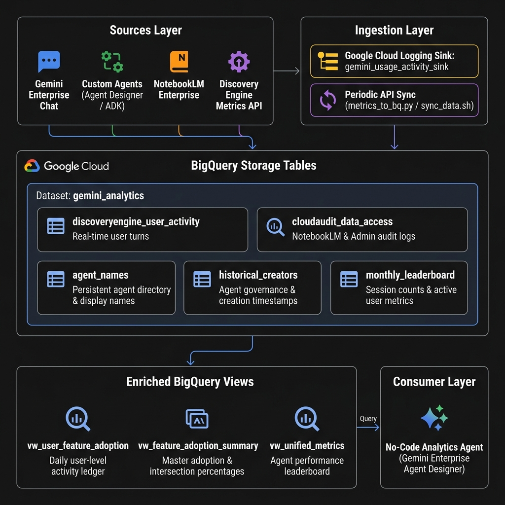
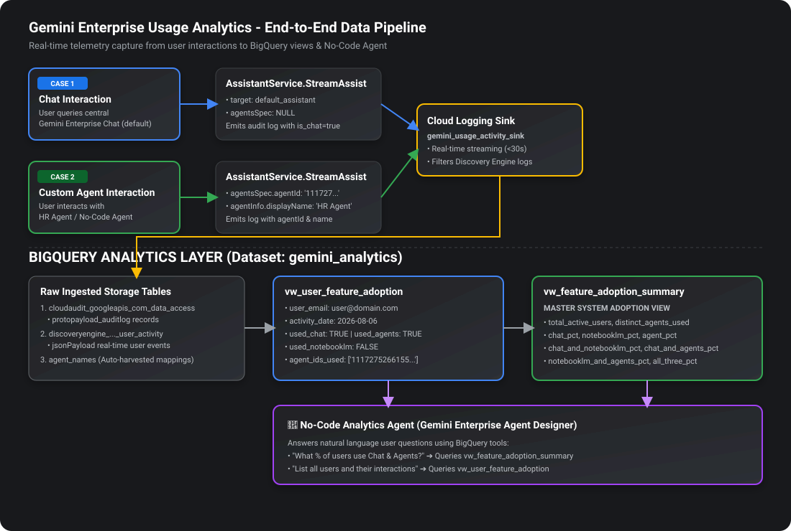
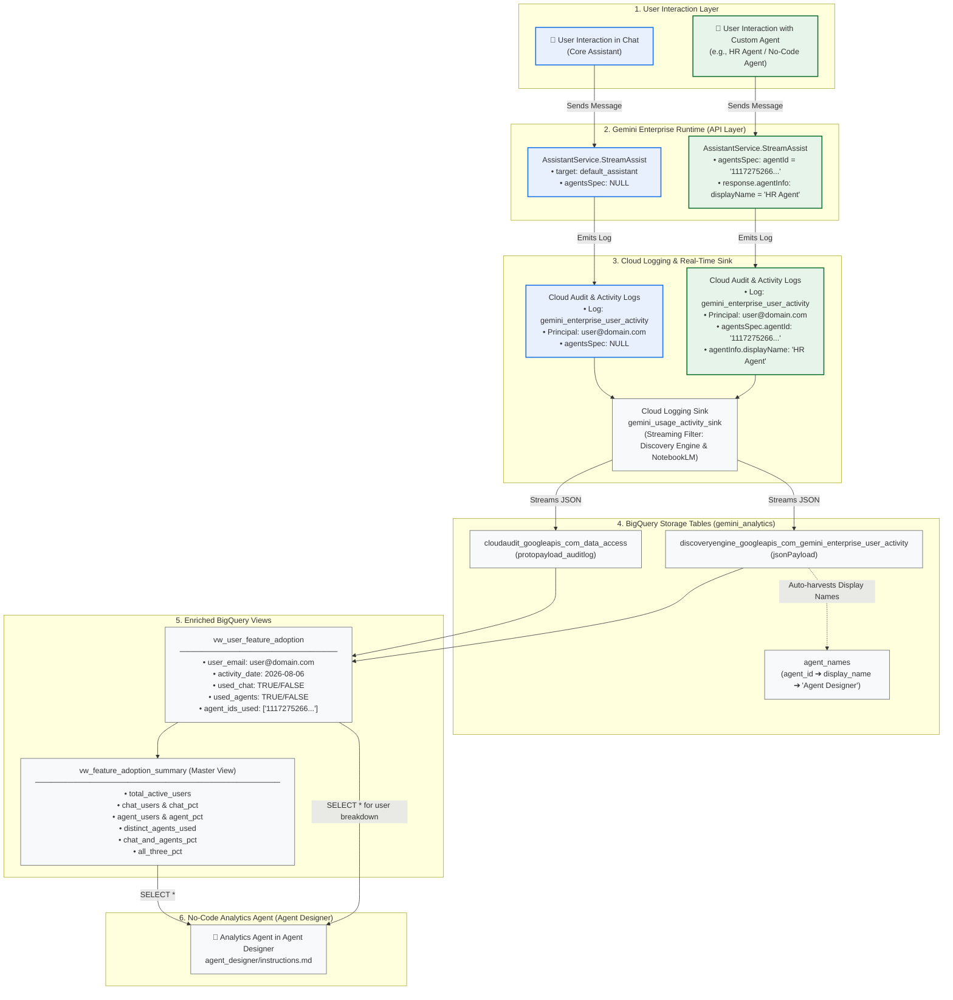

# Gemini Enterprise Usage Analytics - End-to-End Data Flow

This document details the end-to-end data pipeline flow from a user's interaction in **Gemini Enterprise (GE)** to real-time ingestion in **Google Cloud BigQuery** and presentation through the **No-Code Analytics Agent**.

---

## 1. Visual Architecture Flow Diagram

 

---

## 2. Natural Language Guide: BigQuery Storage Tables & Enriched Views

The analytics pipeline organizes data into **5 storage tables** in the `gemini_analytics` BigQuery dataset (covering real-time telemetry, audit logs, and persistent directory mappings) and **3 dynamic views** that calculate adoption metrics and session statistics.

---

### 🗄️ Storage Tables

#### 1. `discoveryengine_googleapis_com_gemini_enterprise_user_activity` *(Raw User Activity Table)*
- **What it is**: The primary real-time telemetry table populated automatically by the Cloud Logging sink (`gemini_usage_activity_sink`).
- **What gets logged**:
  - **User Email (`jsonPayload.userIamPrincipal`)**: The corporate email address of the person interacting with the system (e.g. `user@domain.com`).
  - **Timestamp (`timestamp`)**: The exact second the turn occurred.
  - **Agent Target (`jsonPayload.request.agentsSpec`)**: Contains the `agentId` (e.g. `11172752661556541681`) if the user chatted with or `@mentioned` a custom agent; remains `NULL` if chatting with the general Assistant.
  - **Agent Metadata (`jsonPayload.response.agentInfo`)**: Contains the human-readable `displayName` (e.g. `HR Agent`) and runtime SPIFFE resource ID.

#### 2. `cloudaudit_googleapis_com_data_access` *(Data Access Audit Table)*
- **What it is**: The standard Google Cloud Audit Log table for security and compliance data access events.
- **What gets logged**:
  - **NotebookLM Activity**: Every time a user opens a notebook, uploads sources, or generates audio overviews in NotebookLM Enterprise (`NotebookService`, `SourceService`, `AudioOverviewService`).
  - **Admin Actions**: Records when an agent is created (`AgentService.CreateAgent`), updated, or deleted.
  - **Caller Identity (`protopayload_auditlog.authenticationInfo.principalEmail`)**: The user who triggered the API call (e.g. `creator@domain.com`).

#### 3. `agent_names` *(Persistent Agent Directory)*
- **What it is**: A persistent lookup directory that maps numeric agent IDs to human-readable information.
- **What gets logged**:
  - `agent_id`: The unique numeric identifier (e.g. `11172752661556541681`).
  - `display_name`: The human-readable title (e.g. `Document Summary & Analysis Agent`).
  - `agent_type`: Identifies the architecture (`'Agent Designer'` for no-code UI agents vs `'ADK Agent'`).
  - `description` & `system_instructions`: Stored prompt instructions and agent purpose.
- **How it updates**: Automatically auto-harvests new agent names from real-time user activity logs and periodic sync jobs. **Rows are never deleted**, ensuring historical metrics retain agent names even if the agent is deleted from Google Cloud.

#### 4. `historical_creators` *(Governance & Attribution Table)*
- **What it is**: An audit record mapping each custom agent to the specific person who created it.
- **What gets logged**: `agent_id`, `display_name`, `creator_email` (the administrator/user who built the agent, e.g. `creator@domain.com`), and creation `timestamp`.

#### 5. `agent_session_metrics` *(Aggregated Session Table)*
- **What it is**: Stores periodic usage aggregates pulled from the Discovery Engine `analytics:exportMetrics` API.
- **What gets logged**: `agent_name` (full resource path), calendar `date`, `agent_session_count` (total sessions), and `monthly_agent_active_user_count`.

---

### 🔍 Enriched BigQuery Views

#### 1. `vw_user_feature_adoption` *(Daily User Activity Breakdown)*
- **Purpose**: Normalizes the raw audit logs into a clean, daily user-level activity ledger.
- **What's inside**:
  - `user_email`: The email of the active user (e.g. `user@domain.com`).
  - `activity_date`: The calendar date of the interaction.
  - `used_chat` *(Boolean)*: `TRUE` if the user sent a message to the general Assistant.
  - `used_agents` *(Boolean)*: `TRUE` if the user interacted with or `@mentioned` a custom agent (excluding system tools like `workflow_summary_agent`).
  - `used_notebooklm` *(Boolean)*: `TRUE` if the user performed actions inside NotebookLM.
  - `agent_ids_used` *(Array of Strings)*: The list of specific custom agent IDs the user interacted with on that date.

#### 2. `vw_feature_adoption_summary` *(Master Customer Summary View)*
- **Purpose**: The primary pre-aggregated view queried by the No-Code Analytics Agent to answer adoption and combination questions.
- **What's inside** (1 row per calendar date):
  - `time_period`: The date of activity.
  - `total_active_users`: Total unique people who used any part of the platform that day.
  - `chat_users` & `chat_pct`: Count and percentage of active users using Assistant Chat.
  - `notebooklm_users` & `notebooklm_pct`: Count and percentage of active users using NotebookLM.
  - `agent_users` & `agent_pct`: Count and percentage of active users using custom Agents.
  - `distinct_agents_used`: Total count of unique custom agents used across the organization that day.
  - **Combination Overlaps**:
    - `chat_and_notebooklm_pct`: % of users who used both Chat and NotebookLM.
    - `chat_and_agents_pct`: % of users who used both Chat and Custom Agents.
    - `notebooklm_and_agents_pct`: % of users who used both NotebookLM and Custom Agents.
    - `all_three_pct`: % of users who used Chat, NotebookLM, and Agents all in the same day.

#### 3. `vw_unified_metrics` *(Agent Performance Leaderboard)*
- **Purpose**: Combines API session metrics with human-readable display names from `agent_names`.
- **What's inside**: `agent_id`, `display_name`, `total_sessions` (cumulative session count), `monthly_users`, `first_active_date`, and `last_active_date`.

---

## 3. Interactive Mermaid Architecture Flow

---

## 4. Detailed Execution Flows

### Case 1: User Interacts with Chat (Core Assistant)

1. **User Action**: The user submits a prompt in the central Gemini Enterprise Chat interface (`default_assistant`).
2. **API Layer**:
   - The platform calls `google.cloud.discoveryengine.v1main.AssistantService.StreamAssist` (or `Assist`).
   - Request parameter `name` targets `projects/.../assistants/default_assistant`.
   - Parameter `agentsSpec` is `NULL`.
3. **Cloud Logging**:
   - Google Cloud automatically emits a log entry to `discoveryengine.googleapis.com%2Fgemini_enterprise_user_activity`.
   - Log contains `jsonPayload.userIamPrincipal` (the authenticated user's email, e.g. `user@domain.com`) and `jsonPayload.request.agentsSpec = NULL`.
4. **Cloud Logging Sink**:
   - `gemini_usage_activity_sink` intercepts the log entry and streams it into BigQuery dataset `gemini_analytics` within seconds.
5. **BigQuery Storage**:
   - Raw entry is appended to `discoveryengine_googleapis_com_gemini_enterprise_user_activity` (and `cloudaudit_googleapis_com_data_access`).
6. **BigQuery View Evaluation**:
   - **`vw_user_feature_adoption`**: Identifies that `agents_spec` is `NULL` and `agentInfo.agent` is `NULL`. Flags `used_chat = TRUE` and `used_agents = FALSE` for that user and date.
   - **`vw_feature_adoption_summary`**: Aggregates `chat_users = COUNTIF(used_chat)` and calculates `chat_pct = ROUND(chat_users * 100.0 / total_active_users, 2)`.

---

### Case 2: User Interacts with a Custom Agent (Agent Designer / ADK)

1. **User Action**: The user selects, opens, or @mentions a custom agent (e.g. `HR Agent` with ID `11172752661556541681`).
2. **API Layer**:
   - The platform calls `AssistantService.StreamAssist`.
   - Request parameter `request.agentsSpec.agentSpecs[0].agentId` is populated with `"11172752661556541681"`.
   - Response payload returns `response.agentInfo.displayName = "HR Agent"`.
3. **Cloud Logging**:
   - Cloud Logging records the event under `gemini_enterprise_user_activity` with the user principal (`user@domain.com`), the specific agent ID, and the human-readable display name.
4. **Cloud Logging Sink & Metadata Ingestion**:
   - `gemini_usage_activity_sink` routes the log entry into BigQuery.
   - The mapping table `agent_names` auto-harvests the display name: `11172752661556541681` $\rightarrow$ `"HR Agent"` with `agent_type = 'Agent Designer'`.
5. **BigQuery View Evaluation**:
   - **`vw_user_feature_adoption`**: Excludes internal system agents (e.g. `workflow_summary_agent`), flags `used_agents = TRUE`, and adds `"11172752661556541681"` to `agent_ids_used`.
   - **`vw_feature_adoption_summary`**: Increments `agent_users`, updates `agent_pct`, increments `distinct_agents_used`, and updates combination intersection metrics (such as `chat_and_agents_pct` and `all_three_pct`).
   - **`vw_unified_metrics`**: Joins agent sessions and monthly active users with the human-readable display name from `agent_names`.
